# Konvoy training

## Introduction

During this training, you'll learn how to deploy Konvoy and to use its main features:

* [Introduction](#introduction)
* [Prerequisites](#prerequisites)
* [1. Deploy a Konvoy cluster](#1-deploy-a-konvoy-cluster)
* [2. Expose a Kubernetes Application using a Service Type Load Balancer (L4)](#2-expose-a-kubernetes-application-using-a-service-type-load-balancer-l4)
* [3. Expose a Kubernetes Application using an Ingress (L7)](#3-expose-a-kubernetes-application-using-an-ingress-l7)
* [4. Leverage Network Policies to restrict access](#4-leverage-network-policies-to-restrict-access)
* [5. Leverage persistent storage using Portworx](#5-leverage-persistent-storage-using-portworx)
* [6. Leverage persistent storage using CSI](#6-leverage-persistent-storage-using-csi)
* [7. Deploy Istio using Helm](#7-deploy-istio-using-helm)
* [8. Deploy an application on Istio](#8-deploy-an-application-on-istio)
* [9. Deploy Kafka using KUDO](#9-deploy-kafka-using-kudo)
* [10. Scale a Konvoy cluster](#10-scale-a-konvoy-cluster)
* [11. Upgrade a Konvoy cluster](#11-upgrade-a-konvoy-cluster)
* [12. Konvoy monitoring](#12-konvoy-monitoring)
* [13. Konvoy logging/debugging](#13-konvoy-loggingdebugging)

## Prerequisites

You need either a Linux, MacOS or a Windows laptop.

>For Windows, you need to use the [Google Cloud Shell](https://console.cloud.google.com/cloudshell).

Follow the instructions in [Quickstart](../quickstart.md) and deploy a Kubernetes cluster.

If you use your laptop, you need to have Docker installed.

You also need to install the AWS CLI running the following commands:

```bash
pip3 install awscli --upgrade --user
sudo cp ~/.local/bin/aws /usr/bin/
```

Add the following information provided by the instructor to the `~/.aws/credentials` file (or create the file if necessary):

```
[Temp]
aws_access_key_id     = xxx
aws_secret_access_key = xxx
aws_session_token     = xxx
```

This token will be valid for one hour.

Run the following command to use this profile:

```bash
export AWS_PROFILE=Temp
```

If you don't finish the deployment on time, the instructor will provide an updated token.

Clone the Github repository and run the following commands to uncompress the Konvoy binaries:

```bash
bzip2 -d konvoy_*.tar.bz2
tar xvf konvoy_*.tar
```

Go to the `konvoy` directory:

```bash
cd konvoy_*/
```

## 1. Deploy a Konvoy cluster

### Objectives
- Deploy a Kubernetes cluster with all the addons you need to get a production ready container orchestration platform
- Configure kubectl to manage your cluster

### Why is this Important?
There are many ways to deploy a kubernetes cluster from a fully manual procedure to using a fully automated or opinionated SaaS. Cluster sizes can also widely vary from a single node deployment on your laptop, to thousands of nodes in a single logical cluster, or even across multiple clusters. Thus, picking a deployment model that suits the scale that you need as your business grows is important.


Deploy your cluster using the command below:

```bash
./konvoy up
```

The output should be similar to:

```
./konvoy up                                                                    
This process will take about 15 minutes to complete (additional time may be required for larger clusters), do you want to continue [y/n]: y

STAGE [Provisioning Infrastructure]

Initializing provider plugins...
- Checking for available provider plugins on https://releases.hashicorp.com...
- Downloading plugin for provider "local" (1.3.0)...
- Downloading plugin for provider "random" (2.1.2)...
- Downloading plugin for provider "aws" (2.18.0)...

Terraform has been successfully initialized!

...

STAGE [Deploying Enabled Addons]
awsebscsidriver                                                        [OK]
opsportal                                                              [OK]
calico                                                                 [OK]
helm                                                                   [OK]
awsebscsidriverstorageclassdefault                                     [OK]
dashboard                                                              [OK]
fluentbit                                                              [OK]
kommander                                                              [OK]
velero                                                                 [OK]
traefik                                                                [OK]
prometheus                                                             [OK]
elasticsearch                                                          [OK]
kibana                                                                 [OK]
elasticsearchexporter                                                  [OK]
prometheusadapter                                                      [OK]

STAGE [Removing Disabled Addons]
dex-k8s-authenticator                                                  [OK]
dex                                                                    [OK]
metallb                                                                [OK]
localvolumeprovisioner                                                 [OK]
awsstorageclassdefault                                                 [OK]
localstorageclassdefault                                               [OK]
awsstorageclass                                                        [OK]
awsebscsidriverstorageclass                                            [OK]
localstorageclass                                                      [OK]

Kubernetes cluster and addons deployed successfully!
Run `./konvoy apply kubeconfig` to update kubectl credentials.
Navigate to the URL below to access various services running in the cluster.
  https://ac67953eca32e11e996bb0aa99e2620a-1499310797.us-west-2.elb.amazonaws.com/ops/portal
And login using the credentials below.
  Username: zen_ritchie
  Password: LWeKMAUJs1zxUY7ELApHXn8BPcwUI37tL39Ls8VHZrCGtGOpBaJ1JuSGScu1CunL
If the cluster was recently created, the dashboard and services may take a few minutes to be accessible.
```

As soon as your cluster is successfully deployed, the URL and the credentials to access your cluster are displayed.

If you need to get this information later, you can execute the command below:
```bash
./konvoy get ops-portal
```


Click on the `Kubernetes Dashboard` icon to open it.

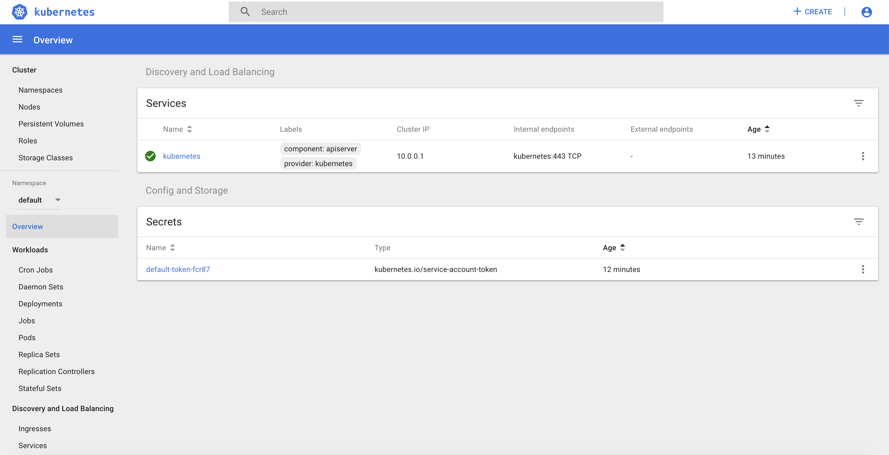

To configure kubectl to manage your cluster, you simply need to run the following command:

```
./konvoy apply kubeconfig
```

You can check that the Kubernetes cluster has been deployed using the version `1.14.3` with 3 control nodes and 3 workers nodes

```bash
kubectl get nodes
NAME                                         STATUS   ROLES    AGE   VERSION
ip-10-0-128-68.us-west-2.compute.internal    Ready    <none>   12m   v1.14.3
ip-10-0-129-150.us-west-2.compute.internal   Ready    <none>   12m   v1.14.3
ip-10-0-130-230.us-west-2.compute.internal   Ready    <none>   12m   v1.14.3
ip-10-0-130-44.us-west-2.compute.internal    Ready    <none>   12m   v1.14.3
ip-10-0-192-227.us-west-2.compute.internal   Ready    master   14m   v1.14.3
ip-10-0-194-159.us-west-2.compute.internal   Ready    master   15m   v1.14.3
ip-10-0-195-109.us-west-2.compute.internal   Ready    master   13m   v1.14.3
```

## 2. Expose a Kubernetes Application using a Service Type Load Balancer (L4)

### Objectives
- Deploy a Redis pod and expose it using a Service Type Load Balancer (L4) and validate that the connection is exposed to the outside
- Deploy a couple hello-world applications and expose them using an Ingress service (L7) and validate that the connection is exposed to the outside

### Why is this Important?
Exposing your application on a kubernetes cluster in an Enterprise-grade environment can be challenging to set up. With Konvoy, the integration with AWS cloud load balancer is already done by default and Traefik is deployed to allow you to easily create Ingresses.

Deploy a redis Pod on your Kubernetes cluster running the following command:

```bash
cat <<EOF | kubectl create -f -
apiVersion: v1
kind: Pod
metadata:
  labels:
    app: redis
  name: redis
spec:
  containers:
  - name: redis
    image: redis:5.0.3
    ports:
    - name: redis
      containerPort: 6379
      protocol: TCP
EOF
```

Then, expose the service, you need to run the following command to create a Service Type Load Balancer:

```bash
cat <<EOF | kubectl create -f -
apiVersion: v1
kind: Service
metadata:
  labels:
    app: redis
  name: redis
spec:
  type: LoadBalancer
  selector:
    app: redis
  ports:
  - protocol: TCP
    port: 6379
    targetPort: 6379
EOF
```

Finally, run the following command to see the URL of the Load Balancer created on AWS for this service:

```bash
kubectl get svc redis

NAME    TYPE           CLUSTER-IP   EXTERNAL-IP                                                               PORT(S)          AGE
redis   LoadBalancer   10.0.51.32   a92b6c9216ccc11e982140acb7ee21b7-1453813785.us-west-2.elb.amazonaws.com   6379:31423/TCP   43s
```

You need to wait for a few minutes while the Load Balancer is created on AWS and the name resolution in place.

```bash
until nslookup $(kubectl get svc redis --output jsonpath={.status.loadBalancer.ingress[*].hostname})
do
  sleep 1
done
```

You can validate that you can access the redis Pod from your laptop using telnet:

```bash
telnet $(kubectl get svc redis --output jsonpath={.status.loadBalancer.ingress[*].hostname}) 6379

Trying 52.27.218.48...
Connected to a92b6c9216ccc11e982140acb7ee21b7-1453813785.us-west-2.elb.amazonaws.com.
Escape character is '^]'.
quit
+OK
Connection closed by foreign host.
```

## 3. Expose a Kubernetes Application using an Ingress (L7)

Deploy 2 web application Pods on your Kubernetes cluster running the following command:

```bash
kubectl run --restart=Never --image hashicorp/http-echo --labels app=http-echo-1 --port 80 http-echo-1 -- -listen=:80 --text="Hello from http-echo-1"
kubectl run --restart=Never --image hashicorp/http-echo --labels app=http-echo-2 --port 80 http-echo-2 -- -listen=:80 --text="Hello from http-echo-2"
```

Then, expose the Pods with a Service Type NodePort using the following commands:

```bash
kubectl expose pod http-echo-1 --port 80 --target-port 80 --type NodePort --name "http-echo-1"
kubectl expose pod http-echo-2 --port 80 --target-port 80 --type NodePort --name "http-echo-2"
```

Finally create the Ingress to expose the application to the outside world using the following command:

```bash
cat <<EOF | kubectl create -f -
apiVersion: extensions/v1beta1
kind: Ingress
metadata:
  name: echo
spec:
  rules:
  - host: "http-echo-1.com"
    http:
      paths:
      - backend:
          serviceName: http-echo-1
          servicePort: 80
  - host: "http-echo-2.com"
    http:
      paths:
      - backend:
          serviceName: http-echo-2
          servicePort: 80
EOF
```

Go to the Traefik UI to check that new frontends have been created.

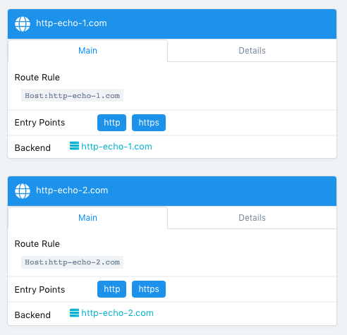

Finally, run the following command to see the URL of the Load Balancer created on AWS for the Traefik service:

```bash
kubectl get svc traefik-kubeaddons -n kubeaddons

NAME                 TYPE           CLUSTER-IP    EXTERNAL-IP                                                             PORT(S)                                     AGE
traefik-kubeaddons   LoadBalancer   10.0.24.215   abf2e5bda6ca811e982140acb7ee21b7-37522315.us-west-2.elb.amazonaws.com   80:31169/TCP,443:32297/TCP,8080:31923/TCP   4h22m
```

You can validate that you can access the web application Pods from your laptop using the following commands:

```bash
curl -k -H "Host: http-echo-1.com" https://$(kubectl get svc traefik-kubeaddons -n kubeaddons --output jsonpath={.status.loadBalancer.ingress[*].hostname})
curl -k -H "Host: http-echo-2.com" https://$(kubectl get svc traefik-kubeaddons -n kubeaddons --output jsonpath={.status.loadBalancer.ingress[*].hostname})
```

## 4. Leverage Network Policies to restrict access

By default, all the pods can access all the services inside and outside the Kubernetes clusters and services exposed to the external world can be accessed by anyone. Kubernetes Network Policies can be used to restrict access.

When a Kubernetes cluster is deployed by Konvoy, a Calico cluster is automatically deployed on this cluster. It allows a user to define network policies without any additional configuration.

### Objectives
- Create a network policy to deny any ingress
- Check that the Redis and the http-echo apps aren't accessible anymore
- Create network policies to allow ingress access to these apps only
- Check that the Redis and the http-echo apps are now accessible

### Why is this Important?
In many cases, you want to restrict communications between services. For example, you often want some micro services to be reachable only other specific micro services.

In this lab, we restrict access to ingresses, so you may thing that it's useless as we can simply not expose these apps if we want to restrict access. But, in fact, it makes sense to also create network policies to avoid cases where an app is exposed by mistake.

Create a network policy to deny any ingress

```bash
cat <<EOF | kubectl create -f -
apiVersion: networking.k8s.io/v1
kind: NetworkPolicy
metadata:
  name: default-deny
spec:
  podSelector: {}
  policyTypes:
  - Ingress
EOF
```

Wait for a minute to allow the network policy to be activated and check that the Redis and the http-echo apps aren't accessible anymore

```bash
telnet $(kubectl get svc redis --output jsonpath={.status.loadBalancer.ingress[*].hostname}) 6379
```

```bash
curl -k -H "Host: http-echo-1.com" https://$(kubectl get svc traefik-kubeaddons -n kubeaddons --output jsonpath={.status.loadBalancer.ingress[*].hostname})
curl -k -H "Host: http-echo-2.com" https://$(kubectl get svc traefik-kubeaddons -n kubeaddons --output jsonpath={.status.loadBalancer.ingress[*].hostname})
```

Create network policies to allow ingress access to these apps only

```bash
cat <<EOF | kubectl create -f -
kind: NetworkPolicy
apiVersion: networking.k8s.io/v1
metadata:
  name: access-redis
spec:
  podSelector:
    matchLabels:
      app: redis
  ingress:
  - from: []
EOF

cat <<EOF | kubectl create -f -
kind: NetworkPolicy
apiVersion: networking.k8s.io/v1
metadata:
  name: access-http-echo-1
spec:
  podSelector:
    matchLabels:
      app: http-echo-1
  ingress:
  - from: []
EOF

cat <<EOF | kubectl create -f -
kind: NetworkPolicy
apiVersion: networking.k8s.io/v1
metadata:
  name: access-http-echo-2
spec:
  podSelector:
    matchLabels:
      app: http-echo-2
  ingress:
  - from: []
EOF
```

Check that the Redis and the http-echo apps are now accessible

```bash
telnet $(kubectl get svc redis --output jsonpath={.status.loadBalancer.ingress[*].hostname}) 6379
```

```bash
curl -k -H "Host: http-echo-1.com" https://$(kubectl get svc traefik-kubeaddons -n kubeaddons --output jsonpath={.status.loadBalancer.ingress[*].hostname})
curl -k -H "Host: http-echo-2.com" https://$(kubectl get svc traefik-kubeaddons -n kubeaddons --output jsonpath={.status.loadBalancer.ingress[*].hostname})
```

Delete the network policy that denies any ingress

```bash
cat <<EOF | kubectl delete -f -
apiVersion: networking.k8s.io/v1
kind: NetworkPolicy
metadata:
  name: default-deny
spec:
  podSelector: {}
  policyTypes:
  - Ingress
EOF
```

## 5. Leverage persistent storage using Portworx

Portworx is a Software Defined Software that can use the local storage of the DC/OS nodes to provide High Available persistent storage to both Kubernetes pods and DC/OS services.

### Objectives
- Deploy Portworx on your Kubernetes cluster to leverage persistent storage using a kubernetes StorageClass
- Create a PersistentVolumeClaim (pvc) to use volumes created in Portworx
- Create a Pod service that will consume this pvc, write data to the persistent volume, and delete the Pod
- Create a second Pod service that will consume the same pvc and validate that data persisted

### Why is this Important?
In recent years, containerization has become a popular way to bundle applications in a way that can be created and destroyed as often as needed. However, initially the containerization space did not support persistent storage, meaning that the data created within a container would disappear when the app finished its work and the container was destroyed. For many use-cases this is undesirable, and the industry has met the need by providing methods of retaining data created by storing them in persistent volumes. This allows for stateful applications such as databases to remain available even if a container goes down.

Mesosphere provides multiple ways to achieving persistent storage for containerized applications. Portworx has been a partner of Mesosphere for many years and is a leading solution for container-based storage on the market. The Portworx solution is well integrated with Konvoy and the Kubernetes community.

Set the following environment variables:

```bash
export CLUSTER=$(grep -m 1 tags.kubernetes.io/cluster state/terraform.tfstate | awk '{ print $2 }' | cut -d\" -f2)
export REGION=us-west-2
```

Update the `~/.aws/credentials` file with the new information provided by your instructor.

Execute the following commands to create and attach an EBS volume to each Kubelet.

```bash
aws --region="$REGION" ec2 describe-instances |  jq --raw-output ".Reservations[].Instances[] | select((.Tags | length) > 0) | select(.Tags[].Value | test(\"$CLUSTER-worker\")) | select(.State.Name | test(\"running\")) | [.InstanceId, .Placement.AvailabilityZone] | \"\(.[0]) \(.[1])\"" | while read -r instance zone; do
  echo "$instance" "$zone"
  volume=$(aws --region="$REGION" ec2 create-volume --size=100  --availability-zone="$zone" --tag-specifications="ResourceType=volume,Tags=[{Key=string,Value=$CLUSTER}]" | jq --raw-output .VolumeId)
  sleep 10
  aws --region=$REGION ec2 attach-volume --device=/dev/xvdc --instance-id="$instance" --volume-id="$volume"
done
```

To be able to use Portworx persistent storage on your Kubernetes cluster, you need to download the Portworx specs using the following command:

```bash
wget -O portworx.yaml "https://install.portworx.com/?mc=false&kbver=1.14.3&b=true&stork=true&lh=true&st=k8s&c=cluster1"
```

Then, you need to edit the `portworx.yaml` file to modify the type of the Kubernetes Service from `NodePort` to `LoadBalancer`:

```
apiVersion: v1
kind: Service
metadata:
  name: px-lighthouse
  namespace: kube-system
  labels:
    tier: px-web-console
spec:
  type: LoadBalancer
  ports:
    - name: http
      port: 80
      targetPort: 80
    - name: https
      port: 443
      targetPort: https
  selector:
    tier: px-web-console
```

Now, you can deploy Portworx using the command below:

```bash
kubectl apply -f portworx.yaml
```

Run the following command until all the pods are running:

```bash
kubectl -n kube-system get pods
```

You need to wait for a few minutes while the Load Balancer is created on AWS and the name resolution in place.

```bash
until nslookup $(kubectl -n kube-system get svc px-lighthouse --output jsonpath={.status.loadBalancer.ingress[*].hostname})
do
  sleep 1
done
echo "Open http://$(kubectl -n kube-system get svc px-lighthouse --output jsonpath={.status.loadBalancer.ingress[*].hostname}) to access the Portworx UI"
```

Access the Portworx UI using the URL indicated and login with the user `admin` and the password `Password1`.


Create the Kubernetes StorageClass using the following command:

```bash
cat <<EOF | kubectl create -f -
kind: StorageClass
apiVersion: storage.k8s.io/v1beta1
metadata:
   name: portworx-sc
provisioner: kubernetes.io/portworx-volume
parameters:
  repl: "2"
EOF
```

It will create volumes on Portworx with 2 replicas.

Create the Kubernetes PersistentVolumeClaim using the following command:

```bash
cat <<EOF | kubectl create -f -
kind: PersistentVolumeClaim
apiVersion: v1
metadata:
  name: pvc001
  annotations:
    volume.beta.kubernetes.io/storage-class: portworx-sc
spec:
  accessModes:
    - ReadWriteOnce
  storageClassName: portworx-sc
  resources:
    requests:
      storage: 1Gi
EOF
```

Check the status of the PersistentVolumeClaim using the following command:

```bash
kubectl describe pvc pvc001
Name:          pvc001
Namespace:     default
StorageClass:  portworx-sc
Status:        Bound
Volume:        pvc-a38e5d2c-7df9-11e9-b547-0ac418899022
Labels:        <none>
Annotations:   pv.kubernetes.io/bind-completed: yes
               pv.kubernetes.io/bound-by-controller: yes
               volume.beta.kubernetes.io/storage-class: portworx-sc
               volume.beta.kubernetes.io/storage-provisioner: kubernetes.io/portworx-volume
Finalizers:    [kubernetes.io/pvc-protection]
Capacity:      1Gi
Access Modes:  RWO
VolumeMode:    Filesystem
Events:
  Type       Reason                 Age   From                         Message
  ----       ------                 ----  ----                         -------
  Normal     ProvisioningSucceeded  12s   persistentvolume-controller  Successfully provisioned volume pvc-a38e5d2c-7df9-11e9-b547-0ac418899022 using kubernetes.io/portworx-volume
Mounted By:  <none>
```

Create a Kubernetes Pod that will use this PersistentVolumeClaim using the following command:

```bash
cat <<EOF | kubectl create -f -
apiVersion: v1
kind: Pod
metadata:
  name: pvpod
spec:
  containers:
  - name: test-container
    image: alpine:latest
    command: [ "/bin/sh" ]
    args: [ "-c", "while true; do sleep 60;done" ]
    volumeMounts:
    - name: test-volume
      mountPath: /test-portworx-volume
  volumes:
  - name: test-volume
    persistentVolumeClaim:
      claimName: pvc001
EOF
```

Create a file in the Volume using the following commands:

```bash
kubectl exec -i pvpod -- /bin/sh -c "echo test > /test-portworx-volume/test"
```

Delete the Pod using the following command:

```bash
kubectl delete pod pvpod
```

Create a Kubernetes Pod that will use the same PersistentVolumeClaim using the following command:

```bash
cat <<EOF | kubectl create -f -
apiVersion: v1
kind: Pod
metadata:
  name: pvpod
spec:
  containers:
  - name: test-container
    image: alpine:latest
    command: [ "/bin/sh" ]
    args: [ "-c", "while true; do sleep 60;done" ]
    volumeMounts:
    - name: test-volume
      mountPath: /test-portworx-volume
  volumes:
  - name: test-volume
    persistentVolumeClaim:
      claimName: pvc001
EOF
```

Validate that the file created in the previous Pod is still available:

```bash
kubectl exec -i pvpod cat /test-portworx-volume/test
```

## 6. Leverage persistent storage using CSI

### Objectives
- Create a PersistentVolumeClaim (pvc) to use the AWS EBS CSI driver
- Create a service that will use this PVC and dynamically provision an EBS volume
- Validate persistence

### Why is this Important?
The goal of CSI is to establish a standardized mechanism for Container Orchestration Systems to expose arbitrary storage systems to their containerized workloads. The CSI specification emerged from cooperation between community members from various Container Orchestration Systems including Kubernetes, Mesos, Docker, and Cloud Foundry.

By creating an industry standard interface, the CSI initiative sets ground rules in order to minimize user confusion. By providing a pluggable standardized interface, the community will be able to adopt and maintain new CSI-enabled storage drivers to their kubernetes clusters as they mature. Choosing a solution that supports CSI integration will allow your business to adopt the latest and greatest storage solutions with ease.

Create the Kubernetes PersistentVolumeClaim using the following command:

```bash
cat <<EOF | kubectl create -f -
apiVersion: v1
kind: PersistentVolumeClaim
metadata:
  name: dynamic
spec:
  accessModes:
    - ReadWriteOnce
  storageClassName: ebs-csi-driver
  resources:
    requests:
      storage: 1Gi
EOF
```

Create a Kubernetes Deployment that will use this PersistentVolumeClaim using the following command:

```bash
cat <<EOF | kubectl create -f -
apiVersion: apps/v1
kind: Deployment
metadata:
  name: ebs-dynamic-app
  labels:
    app: ebs-dynamic-app
spec:
  replicas: 1
  selector:
    matchLabels:
      app: ebs-dynamic-app
  template:
    metadata:
      labels:
        app: ebs-dynamic-app
    spec:
      containers:
      - name: ebs-dynamic-app
        image: centos:7
        command: ["/bin/sh"]
        args: ["-c", "while true; do echo \$(date -u) >> /data/out.txt; sleep 5; done"]
        volumeMounts:
        - name: persistent-storage
          mountPath: /data
      volumes:
      - name: persistent-storage
        persistentVolumeClaim:
          claimName: dynamic
EOF
```

Run the following command until the pod is running:

```bash
kubectl get pods
```

Check the content of the file `/data/out.txt` and note the first timestamp:

```bash
pod=$(kubectl get pods | grep ebs-dynamic-app | awk '{ print $1 }')
kubectl exec -i $pod cat /data/out.txt
```

Delete the Pod using the following command:

```bash
kubectl delete pod $pod
```

The Deployment will recreate the pod automatically.

Run the following command until the pod is running:

```bash
kubectl get pods
```

Check the content of the file `/data/out.txt` and verify that the first timestamp is the same as the one noted previously:

```bash
pod=$(kubectl get pods | grep ebs-dynamic-app | awk '{ print $1 }')
kubectl exec -i $pod cat /data/out.txt
```

## 7. Deploy Istio using Helm

Cloud platforms provide a wealth of benefits for the organizations that use them.
There’s no denying, however, that adopting the cloud can put strains on DevOps teams.
Developers must use microservices to architect for portability, meanwhile operators are managing extremely large hybrid and multi-cloud deployments.
Istio lets you connect, secure, control, and observe services.

At a high level, Istio helps reduce the complexity of these deployments, and eases the strain on your development teams.
It is a completely open source service mesh that layers transparently onto existing distributed applications.
It is also a platform, including APIs that let it integrate into any logging platform, or telemetry or policy system.
Istio’s diverse feature set lets you successfully, and efficiently, run a distributed microservice architecture, and provides a uniform way to secure, connect, and monitor microservices.

Download the latest release of Istio using the following command:

```bash
curl -L https://git.io/getLatestIstio | ISTIO_VERSION=1.2.2 sh -
```

Run the following commands to go to the Istio directory and to create the Istio CRDs using Helm:

```bash
cd istio*
export PATH=$PWD/bin:$PATH
helm install install/kubernetes/helm/istio-init --name istio-init --namespace istio-system
```

Wait until the 23 CRDs have been created:

```bash
until kubectl get crds | grep 'istio.io\|certmanager.k8s.io' | wc -l | grep 23
do
  sleep 1
done

23
```

Run the following commands to install Istio using Helm:

```bash
helm install install/kubernetes/helm/istio --name istio --namespace istio-system
```

Wait until all the Istio pods are running:

```bash
kubectl -n istio-system get pods

NAME                                      READY   STATUS      RESTARTS   AGE
istio-citadel-68c85b6684-ghp95            1/1     Running     0          3m42s
istio-galley-77d697957f-wfhnx             1/1     Running     0          3m42s
istio-ingressgateway-8b858ff84-mmcm2      1/1     Running     0          3m42s
istio-init-crd-10-l9vkw                   0/1     Completed   0          3m57s
istio-init-crd-11-tk9hf                   0/1     Completed   0          3m57s
istio-init-crd-12-9jrdz                   0/1     Completed   0          3m57s
istio-pilot-5544b58bb6-257nb              2/2     Running     0          3m42s
istio-policy-5f9cf6df57-pgxq7             2/2     Running     3          3m42s
istio-sidecar-injector-66549495d8-gq2kb   1/1     Running     0          3m42s
istio-telemetry-7749c6d54f-g4q25          2/2     Running     2          3m42s
prometheus-776fdf7479-lrwvq               1/1     Running     0          3m42s
```

## 8. Deploy an application on Istio

This example deploys a sample application composed of four separate microservices used to demonstrate various Istio features.
The application displays information about a book, similar to a single catalog entry of an online book store.
Displayed on the page is a description of the book, book details (ISBN, number of pages, and so on), and a few book reviews.

Run the following commands to deploy the bookinfo application:

```bash
kubectl apply -f <(istioctl kube-inject -f samples/bookinfo/platform/kube/bookinfo.yaml)
kubectl apply -f samples/bookinfo/networking/bookinfo-gateway.yaml
```

Finally, run the following command to get the URL of the Load Balancer created on AWS for this service:

```bash
kubectl get svc istio-ingressgateway -n istio-system

NAME                   TYPE           CLUSTER-IP    EXTERNAL-IP                                                               PORT(S)                                                                                                                                      AGE
istio-ingressgateway   LoadBalancer   10.0.29.241   a682d13086ccf11e982140acb7ee21b7-2083182676.us-west-2.elb.amazonaws.com   15020:30380/TCP,80:31380/TCP,443:31390/TCP,31400:31400/TCP,15029:30756/TCP,15030:31420/TCP,15031:31948/TCP,15032:32061/TCP,15443:31232/TCP   110s
```

You need to wait for a few minutes while the Load Balancer is created on AWS and the name resolution in place.

```bash
until nslookup $(kubectl get svc istio-ingressgateway -n istio-system --output jsonpath={.status.loadBalancer.ingress[*].hostname})
do
  sleep 1
done
echo "Open http://$(kubectl get svc istio-ingressgateway -n istio-system --output jsonpath={.status.loadBalancer.ingress[*].hostname})/productpage to access the BookInfo Sample app"
```

Go to the corresponding URL to access the BookInfo Sample app.


You can then follow the other steps described in the Istio documentation to understand the different Istio features:

[https://istio.io/docs/examples/bookinfo/](https://istio.io/docs/examples/bookinfo/)

## 9. Deploy Kafka using KUDO

The Kubernetes Universal Declarative Operator (KUDO) is a highly productive toolkit for writing operators for Kubernetes. Using KUDO, you can deploy your applications, give your users the tools they need to operate it, and understand how it's behaving in their environments — all without a PhD in Kubernetes.

Go back to the konvoy directory:

```bash
cd ..
```

Run the following commands to deploy KUDO on your Kubernetes cluster:

```bash
kubectl create -f https://raw.githubusercontent.com/kudobuilder/kudo/master/docs/deployment/00-prereqs.yaml
kubectl create -f https://raw.githubusercontent.com/kudobuilder/kudo/master/docs/deployment/10-crds.yaml
kubectl create -f https://raw.githubusercontent.com/kudobuilder/kudo/master/docs/deployment/20-deployment.yaml
```

Check the status of the KUDO controller:

```bash
kubectl get pods -n kudo-system
NAME                        READY   STATUS    RESTARTS   AGE
kudo-controller-manager-0   1/1     Running   0          84s
```

Install the KUDO CLI (on Mac):

```bash
brew tap kudobuilder/tap
brew install kudo-cli
```

Install the KUDO CLI (on Linux):

```bash
wget https://github.com/kudobuilder/kudo/releases/download/v0.3.1/kubectl-kudo_0.3.1_linux_x86_64
sudo mv kubectl-kudo_0.3.1_linux_x86_64 /usr/bin/kubectl-kudo
chmod +x /usr/bin/kubectl-kudo
```

Deploy ZooKeeper using KUDO:

```bash
kubectl kudo install zookeeper --instance=zk

operator.kudo.k8s.io/v1alpha1/zookeeper created
operatorversion.kudo.k8s.io/v1alpha1/zookeeper-0.1.0 created
No instance named 'zk' tied to this 'zookeeper' version has been found. Do you want to create one? (Yes/no) yes
instance.kudo.k8s.io/v1alpha1/zk created
```

Check the status of the deployment:

```bash
kubectl kudo plan status --instance=zk

Plan(s) for "zk" in namespace "default":
.
└── zk (Operator-Version: "zookeeper-0.1.0" Active-Plan: "zk-deploy-694218097")
    ├── Plan deploy (serial strategy) [COMPLETE]
    │   └── Phase zookeeper (parallel strategy) [COMPLETE]
    │       └── Step everything (COMPLETE)
    └── Plan validation (serial strategy) [NOT ACTIVE]
        └── Phase connection (parallel strategy) [NOT ACTIVE]
            └── Step connection (parallel strategy) [NOT ACTIVE]
                └── connection [NOT ACTIVE]
```

And check that the corresponding Pods are running:

```bash
kubectl get pods | grep zk

zk-zk-0                            1/1     Running   0          2m48s
zk-zk-1                            1/1     Running   0          2m48s
zk-zk-2                            1/1     Running   0          2m48s
```

Deploy Kafka using KUDO:

```bash
kubectl kudo install kafka --instance=kafka
```

Check the status of the deployment:

```bash
kubectl kudo plan status --instance=kafka

Plan(s) for "kafka" in namespace "default":
.
└── kafka (Operator-Version: "kafka-0.1.1" Active-Plan: "kafka-deploy-260200627")
    └── Plan deploy (serial strategy) [COMPLETE]
        └── Phase deploy-kafka (serial strategy) [COMPLETE]
            └── Step deploy (COMPLETE)
```

And check that the corresponding Pods are running:

```bash
kubectl get pods | grep kafka

zk-zk-0                            1/1     Running   0          2m48s
zk-zk-1                            1/1     Running   0          2m48s
zk-zk-2                            1/1     Running   0          2m48s
```

Produce messages in Kafka:

```bash
cat <<EOF | kubectl create -f -
apiVersion: apps/v1beta1
kind: Deployment
metadata:
  name: kudo-kafka-generator
spec:
  replicas: 1
  template:
    metadata:
      name: kudo-kafka-generator
      labels:
        app: kudo-kafka-generator
    spec:
      containers:
      - name: kudo-kafka-generator
        image: mesosphere/flink-generator:0.1
        command: ["/generator-linux"]
        imagePullPolicy: Always
        args: ["--broker", "kafka-kafka-0.kafka-svc:9092"]
EOF
```

Consume messages from Kafka:

```bash
cat <<EOF | kubectl create -f -
apiVersion: apps/v1beta1
kind: Deployment
metadata:
 name: kudo-kafka-consumer
spec:
 replicas: 1
 template:
   metadata:
     name: kudo-kafka-consumer
     labels:
       app: kudo-kafka-consumer
   spec:
     containers:
     - name: kudo-kafka-consumer
       image: tbaums/kudo-kafka-demo
       imagePullPolicy: Always
       env:
        - name: BROKER_SERVICE
          value: kafka-kafka-0.kafka-svc:9092
EOF
```

Check the logs:

```bash
kubectl logs $(kubectl get pods -l app=kudo-kafka-consumer -o jsonpath='{.items[0].metadata.name}') --follow

Message: b'2019-07-11T16:28:45Z;0;6;4283'
Message: b'2019-07-11T16:28:46Z;1;8;4076'
Message: b'2019-07-11T16:28:47Z;5;2;9140'
Message: b'2019-07-11T16:28:48Z;5;8;8603'
Message: b'2019-07-11T16:28:49Z;1;0;5097'
```

## 10. Scale a Konvoy cluster

Update the `~/.aws/credentials` file with the new information provided by your instructor.

Edit the `cluster.yaml` file to change the worker count from 4 to 5:
```
...
nodePools:
- name: worker
  count: 5
...
```

And run `./konvoy up` again.

Check that there are now 5 kubelets deployed:

```
kubectl get nodes

NAME                                         STATUS   ROLES    AGE     VERSION
ip-10-0-128-68.us-west-2.compute.internal    Ready    <none>   3h13m   v1.14.3
ip-10-0-129-150.us-west-2.compute.internal   Ready    <none>   3h13m   v1.14.3
ip-10-0-129-204.us-west-2.compute.internal   Ready    <none>   6m56s   v1.14.3
ip-10-0-130-230.us-west-2.compute.internal   Ready    <none>   3h13m   v1.14.3
ip-10-0-130-44.us-west-2.compute.internal    Ready    <none>   3h13m   v1.14.3
ip-10-0-192-227.us-west-2.compute.internal   Ready    master   3h14m   v1.14.3
ip-10-0-194-159.us-west-2.compute.internal   Ready    master   3h15m   v1.14.3
ip-10-0-195-109.us-west-2.compute.internal   Ready    master   3h13m   v1.14.3
```

## 11. Upgrade a Konvoy cluster

Edit the `cluster.yaml` file to change the Kubernetes version from `1.14.3` to `1.14.4`:
```
...
kind: ClusterConfiguration
apiVersion: konvoy.mesosphere.io/v1alpha1
metadata:
  name: konvoy_v0.3.0
  creationTimestamp: "2019-07-10T08:24:35.1379638Z"
spec:
  kubernetes:
    version: 1.14.4
...
```

```bash
./konvoy upgrade kubernetes

This process will take about 20 minutes to complete (additional time may be required for larger clusters), do you want to continue [y/n]: y

STAGE [Determining Upgrade Safety]

ip-10-0-128-199.us-west-2.compute.internal                             [OK]
ip-10-0-128-60.us-west-2.compute.internal (will not be upgraded)       [WARNING]
  - Pod "default/http-echo-1" is not being managed by a controller. Upgrading this node might result in data or availability loss.
  - Pod "default/redis" is not being managed by a controller. Upgrading this node might result in data or availability loss.
ip-10-0-129-147.us-west-2.compute.internal (will not be upgraded)      [WARNING]
  - Pod "default/http-echo-2" is not being managed by a controller. Upgrading this node might result in data or availability loss.
ip-10-0-130-132.us-west-2.compute.internal                             [OK]

STAGE [Upgrading Kubernetes]

PLAY [Upgrade Control Plane] ************************************************************************************************************************************************************

TASK [Gathering Facts] ******************************************************************************************************************************************************************
ok: [10.0.192.88]

TASK [packages-kubeadm : install kubeadm rpm package] ***********************************************************************************************************************************
changed: [10.0.192.88]

TASK [packages-kubeadm : load br_netfilter kernel module] *******************************************************************************************************************************
ok: [10.0.192.88]

TASK [packages-kubeadm : set bridge-nf-call-iptables to 1] ******************************************************************************************************************************
ok: [10.0.192.88] => (item=net.bridge.bridge-nf-call-ip6tables)
ok: [10.0.192.88] => (item=net.bridge.bridge-nf-call-iptables)

...

PLAY [Upgrade Nodes] ********************************************************************************************************************************************************************

TASK [Gathering Facts] ******************************************************************************************************************************************************************
ok: [10.0.130.132]

TASK [packages-kubeadm : install kubeadm rpm package] ***********************************************************************************************************************************
changed: [10.0.130.132]

TASK [packages-kubeadm : load br_netfilter kernel module] *******************************************************************************************************************************
ok: [10.0.130.132]

TASK [packages-kubeadm : set bridge-nf-call-iptables to 1] ******************************************************************************************************************************
ok: [10.0.130.132] => (item=net.bridge.bridge-nf-call-ip6tables)
ok: [10.0.130.132] => (item=net.bridge.bridge-nf-call-iptables)

TASK [packages-kubeadm : set net.ipv4.ip_forward to 1] **********************************************************************************************************************************
ok: [10.0.130.132]

TASK [kubeadm-upgrade-nodes : read marker file] *****************************************************************************************************************************************
ok: [10.0.130.132]

TASK [kubeadm-upgrade-nodes : decode marker file] ***************************************************************************************************************************************
ok: [10.0.130.132]

TASK [kubeadm-upgrade-nodes : get node name] ********************************************************************************************************************************************
ok: [10.0.130.132 -> ec2-54-202-94-86.us-west-2.compute.amazonaws.com]

TASK [kubeadm-upgrade-nodes : set node name fact] ***************************************************************************************************************************************
ok: [10.0.130.132]

TASK [kubeadm-upgrade-nodes : drain node] ***********************************************************************************************************************************************
changed: [10.0.130.132 -> ec2-54-202-94-86.us-west-2.compute.amazonaws.com]

TASK [kubeadm-upgrade-nodes : run kubeadm upgrade] **************************************************************************************************************************************
changed: [10.0.130.132]

TASK [marker-file : write out marker file] **********************************************************************************************************************************************
changed: [10.0.130.132]

TASK [packages-containerd : create containerd systemd directory] ************************************************************************************************************************
ok: [10.0.130.132]

TASK [packages-containerd : create containerd directory] ********************************************************************************************************************************
ok: [10.0.130.132]

TASK [packages-containerd : copy default containerd configuration to remote] ************************************************************************************************************
ok: [10.0.130.132]

TASK [packages-containerd : copy containerd configuration override to remote] ***********************************************************************************************************
skipping: [10.0.130.132]

TASK [packages-containerd : copy HTTP proxy drop-in to remote] **************************************************************************************************************************
ok: [10.0.130.132]

TASK [packages-containerd : install libseccomp rpm package] *****************************************************************************************************************************
ok: [10.0.130.132]

TASK [packages-containerd : install containerd.io rpm package] **************************************************************************************************************************
ok: [10.0.130.132]

TASK [packages-containerd : ensure containerd service is started] ***********************************************************************************************************************
ok: [10.0.130.132]

TASK [packages-kubernetes : create kubelet systemd directory] ***************************************************************************************************************************
ok: [10.0.130.132]

TASK [packages-kubernetes : copy HTTP proxy drop-in to remote] **************************************************************************************************************************
ok: [10.0.130.132]

TASK [packages-kubernetes : install nfs-utils rpm package] ******************************************************************************************************************************
ok: [10.0.130.132]

TASK [packages-kubernetes : install kubelet rpm package] ********************************************************************************************************************************
changed: [10.0.130.132]

TASK [packages-kubernetes : install kubectl rpm package] ********************************************************************************************************************************
skipping: [10.0.130.132]

TASK [packages-kubernetes : install kubeadm rpm package] ********************************************************************************************************************************
ok: [10.0.130.132]

RUNNING HANDLER [packages-containerd : reload systemd] **********************************************************************************************************************************
changed: [10.0.130.132]

RUNNING HANDLER [packages-kubernetes : restart kubelet] *********************************************************************************************************************************
changed: [10.0.130.132]

RUNNING HANDLER [packages-kubernetes : kubelet health] **********************************************************************************************************************************
ok: [10.0.130.132]

TASK [uncordon node] ********************************************************************************************************************************************************************
changed: [10.0.130.132 -> ec2-54-202-94-86.us-west-2.compute.amazonaws.com]

PLAY RECAP ******************************************************************************************************************************************************************************
10.0.128.199               : ok=28   changed=8    unreachable=0    failed=0   
10.0.130.132               : ok=28   changed=8    unreachable=0    failed=0   
10.0.192.88                : ok=29   changed=7    unreachable=0    failed=0   
10.0.193.156               : ok=29   changed=7    unreachable=0    failed=0   
10.0.194.83                : ok=29   changed=7    unreachable=0    failed=0   


Kubernetes cluster upgraded successfully!
```

Check that the Redis and the http-echo apps are still accessible

```bash
telnet $(kubectl get svc redis --output jsonpath={.status.loadBalancer.ingress[*].hostname}) 6379
```

```bash
curl -k -H "Host: http-echo-1.com" https://$(kubectl get svc traefik-kubeaddons -n kubeaddons --output jsonpath={.status.loadBalancer.ingress[*].hostname})
curl -k -H "Host: http-echo-2.com" https://$(kubectl get svc traefik-kubeaddons -n kubeaddons --output jsonpath={.status.loadBalancer.ingress[*].hostname})
```


## 12. Konvoy monitoring

In Konvoy, all the metrics are stored in a Prometheus cluster and exposed through Grafana.

To access the Grafana UI, click on the `Grafana Metrics` icon on the Konvoy UI.

Take a look at the different Dashboards available.

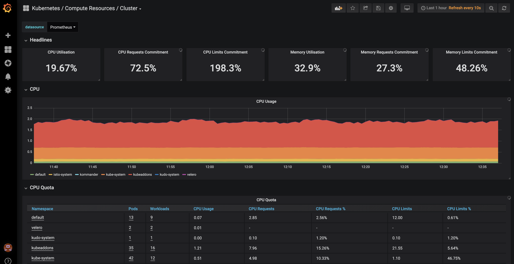

You can also access the Prometheus UI to see all the metrics available by clicking on the `Prometheus` icon on the Konvoy UI.

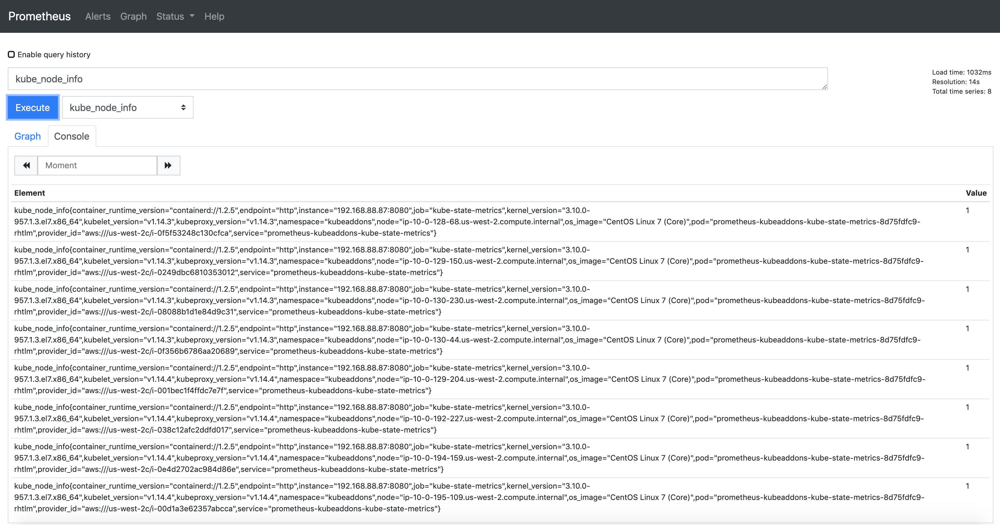

KUDO Kafka operator comes by default the JMX Exporter agent enabled.

When Kafka operator deployed with parameter `METRICS_ENABLED=true` (which defaults to `true`) then:

- Each broker bootstraps with [JMX Exporter](https://github.com/prometheus/jmx_exporter) java agent exposing the metrics at `9094/metrics`
- Adds a port named `metrics` to the Kafka Service
- Adds a label `kubeaddons.mesosphere.io/servicemonitor: "true"` for the service monitor discovery.

Run the following command to enable Kafka metrics export:

```bash
kubectl create -f https://raw.githubusercontent.com/kudobuilder/operators/master/repository/kafka/docs/v0.1/resources/service-monitor.yaml
```

In the Grafana UI, click on the + sign on the left and select `Import`.

Copy the content of this [file](https://raw.githubusercontent.com/kudobuilder/operators/master/repository/kafka/docs/v0.1/resources/grafana-dashboard.json) as shown in the picture below.

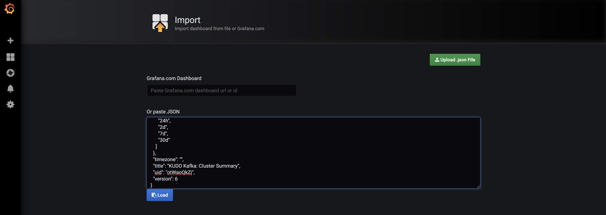

Click on `Load`.

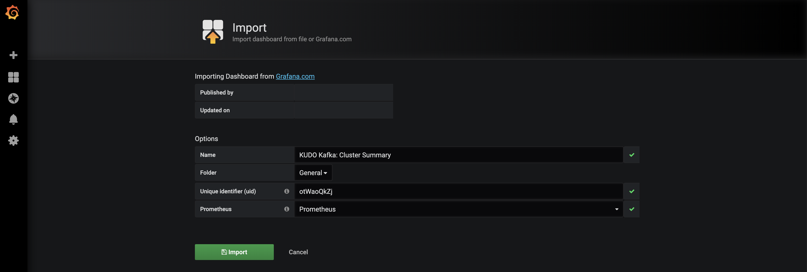

Select `Prometheus` in the `Prometheus` field and click on `Import`.

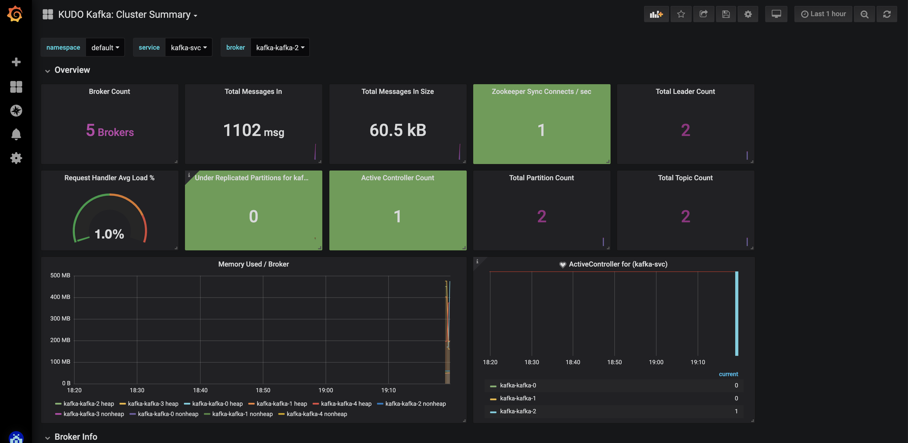

## 13. Konvoy logging/debugging

In Konvoy, all the logs are stored in an Elasticsearch cluster and exposed through Kibana.

To access the Kibana UI, click on the `Kibana Logs` icon on the Konvoy UI.

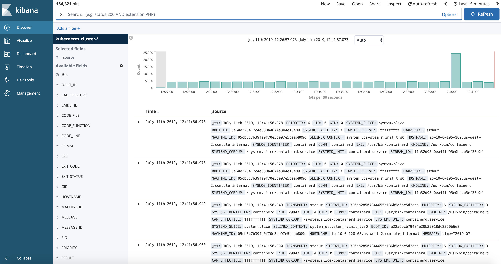

By default, it only shows the logs for the latest 15 minutes.

Click on the top right corner and select `Last 24 hours`.

Then, search for `redis`:

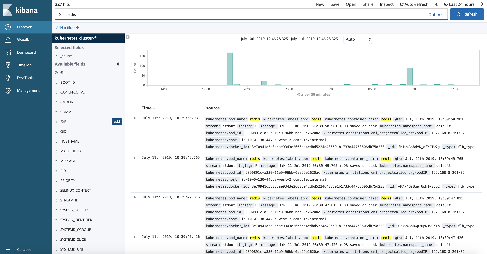

You'll see all the logs related to the redis Pod and Service you deployed previously.

### 13.1. Ingress troubleshooting.

In this section, we will leverage Konvoy logging to troubleshoot Ingress failure issue.

We will deploy a nginx application and expose it via L7 loadbalancer. The application can be accessed with URLs follows below patten.

`http[s]://$(kubectl get svc traefik-kubeaddons -n kubeaddons --output jsonpath="{.status.loadBalancer.ingress[*].hostname}")/applications/nginx/`

* first, let's deploy a nginx application and scale it to 3

```bash
kubectl run --image=nginx --replicas=3 --port=80 --restart=Always nginx
```
* 2nd, expose a in cluster service

```bash
kubectl expose deploy nginx --port 8080 --target-port 80 --type NodePort --name "svc-nginx"
```
* 3rd, create a ingress to expose service via Layer7 LB

```bash
cat << EOF | kubectl apply -f -
apiVersion: extensions/v1beta1
kind: Ingress
metadata:
  name: nginx-root
  namespace: default
spec:
  rules:
  - http:
      paths:
      - backend:
          serviceName: svc-nginx
          servicePort: 8080
        path:  /applications/nginx/
EOF
```
* 4th, Now check Ingress configure in Traefik

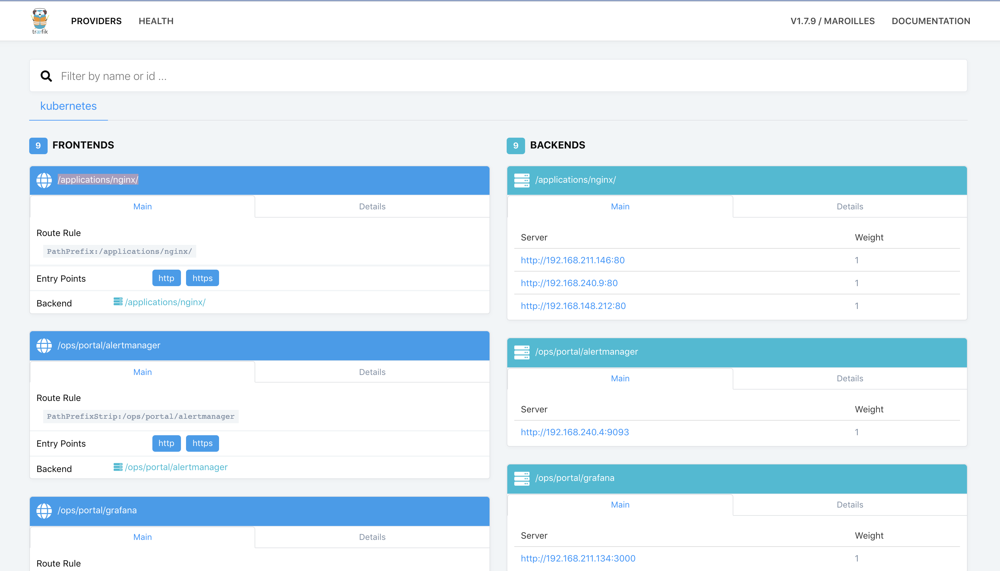

The `Traefik dashboard` indicates the nginx application is ready to receive traffic but if you try access nginx with URL listed below, you will notice `404 Not Found` error like:

```bash

curl -k https://$(kubectl get svc traefik-kubeaddons -n kubeaddons --output jsonpath="{.status.loadBalancer.ingress[*].hostname}")/applications/nginx/

```


Let's troubleshooting this failure with Konvoy Kibana.

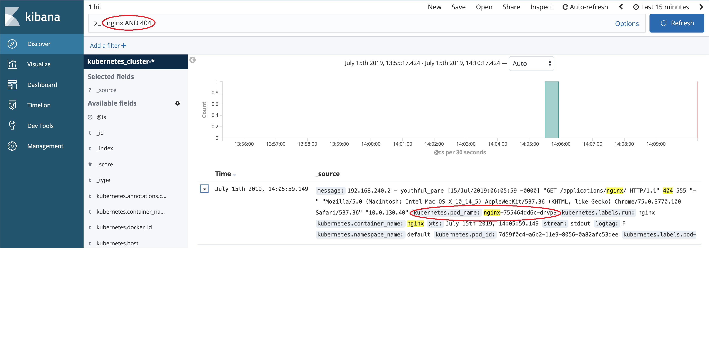

With Konvoy Kibana near real time log collection and indexing, we can easily identify the ingress traffic is eventually handled by pod `kubernetes.pod_name:nginx-755464dd6c-dnvp9`.

So the obviously possible root-cause is PATH `/applications/nginx/` not mapped to any nginx internal handler.

In general, when nginx is launched with default configuration, it listens on `ROOT` path `(/)`. To fix this failure, we need to strip PATH `/applications/nginx/` to `ROOT (/)` path before traefik re-route traffic to nginx.

According to `Traefik` documentation [PathPrefixStrip](https://docs.traefik.io/configuration/backends/kubernetes/), the annotation `(traefik.ingress.kubernetes.io/rule-type)` is exactly what we need to direct traefik to strip ingress HOST PATH to ROOT PATH forementioned.

To update `Ingress`, we can use below command.

```bash
cat << EOF | kubectl apply -f -
apiVersion: extensions/v1beta1
kind: Ingress
metadata:
  annotations:
    traefik.frontend.rule.type: PathPrefixStrip
  name: nginx-root
  namespace: default
spec:
  rules:
  - http:
      paths:
      - backend:
          serviceName: svc-nginx
          servicePort: 8080
        path:  /applications/nginx/
EOF
```
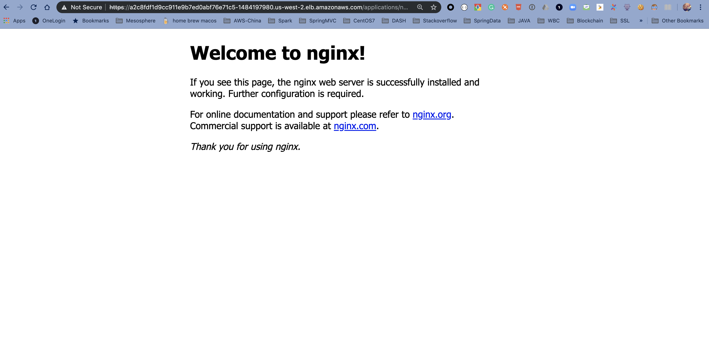
